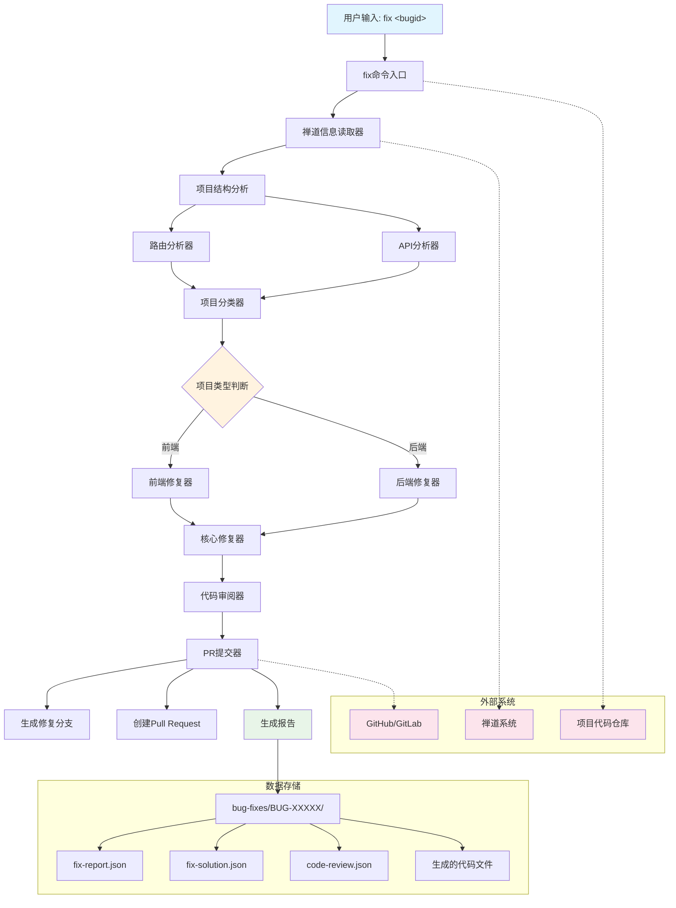
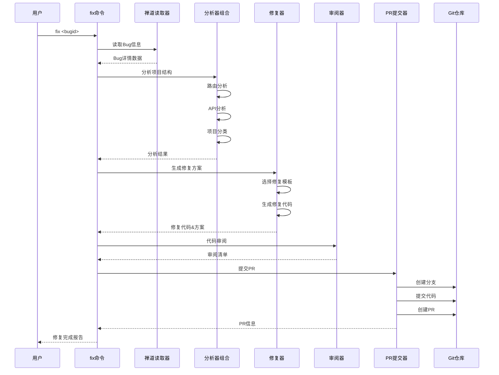

# BUG自动化修复方案

## 概述

这是一个基于AI的BUG自动化修复系统，能够根据禅道中的BUG ID，自动分析问题、生成修复代码并创建Pull Request。

## 系统架构

### 架构图



### 数据流架构



### 核心组件

1. **fix命令入口** (`commands/fix.md`) - 用户命令接口
2. **禅道信息读取器** (`prompts/禅道信息读取提示词.md`) - 获取bug详情
3. **路由分析器** (`prompts/路由分析提示词.md`) - 分析前端路由结构
4. **API分析器** (`prompts/API分析提示词.md`) - 分析接口文档
5. **项目分类器** (`prompts/项目分类提示词.md`) - 判断前端/后端项目
6. **核心修复器** (`prompts/BUG修复提示词.md`) - 生成修复方案
7. **代码审阅器** (`prompts/代码审阅提示词.md`) - 生成审阅清单
8. **PR提交器** (`prompts/PR提交提示词.md`) - 自动创建Pull Request

### 工作流程

```
用户输入: fix <bugid>
    ↓
1. 读取禅道bug信息
    ↓
2. 分析项目结构(路由/API)
    ↓
3. 判断项目类型(前端/后端)
    ↓
4. 生成修复方案和代码
    ↓
5. 创建代码审阅清单
    ↓
6. 提交PR并生成报告
```

## 安装和使用

### 安装依赖

```bash
npm install
```

### 环境配置

创建 `.env` 文件：

```env
ZENTAO_BASE_URL=https://your-zentao.com
ZENTAO_TOKEN=your-api-token
# 或者使用用户名密码
ZENTAO_USERNAME=your-username
ZENTAO_PASSWORD=your-password
```

### 使用方法

```bash
# 修复指定Bug
/fix 12345

# 自动提交模式
/fix 12345 --auto-commit

# 只生成方案，不创建PR
/fix 12345 --no-pr

# 查看修复状态
/status 12345
```

## 功能特性

### 1. 智能项目类型识别

- 基于关键词分析判断前端/后端问题
- 路由匹配识别前端相关问题
- API错误模式识别后端问题

### 2. 自动代码生成

**前端修复代码:**
- 基于前端对应宿主项目rules文件对前端代码进行修复

**后端修复代码:**
- 基于后端宿主项目rules文件对后端代码进行修复

### 3. 代码审阅流程

- 自动生成审阅检查清单（需人工审阅）


## 输出文件结构

```
bug-fixes/
└── BUG-12345/
    ├── fix-report.json          # 修复报告
    ├── fix-solution.json        # 详细修复方案
    ├── code-review.json         # 审阅结果
    ├── pr-info.json            # PR信息
    ├── BUG-12345-修复方案.md    # Markdown报告
    ├── 代码审阅检查清单.md        # 审阅清单
    ├── PR跟踪.md               # PR跟踪文档
    └── generated-code/         # 生成后的代码变更描述
        ├── frontend/
        └── backend/
```

## 配置选项

可以创建 `.bugfixer.json` 配置文件:

```json
{
  "zentaoUrl": "https://your-zentao.com",
  "projectPath": "./",
  "outputPath": "./bug-fixes",
  "gitRemote": "origin",
  "baseBranch": "main",
  "branchPrefix": "fix-bug-",
  "autoMerge": false
}
```

## 扩展性

### 添加新的修复模式

1. 在 `prompts/代码审阅提示词.md` 中添加新的代码生成模板
2. 在 `prompts/项目分类提示词.md` 中添加新的识别规则
3. 在 `prompts/BUG修复提示词.md` 中添加新的修复策略

### 支持新的项目管理系统

1. 创建新的信息读取提示词 (如 `prompts/JIRA信息读取提示词.md`)
2. 在主流程提示词中集成新的读取器
3. 适配统一的数据格式

### 支持新的代码托管平台

1. 创建新的PR提交提示词 (如 `prompts/GitLab提交提示词.md`)
2. 实现统一的PR接口提示词

## 数据资产

系统会自动生成以下数据资产：

1. **问题分类模型** - 基于历史数据训练的问题分类
2. **修复模式库** - 常见问题的修复模板
3. **代码质量规则** - 自动审阅的最佳实践

## 监控和优化

- 修复成功率统计
- 代码质量评分
- 持续优化建议

## 安全考虑

- API密钥安全存储
- 代码注入防护

---

此系统旨在提高开发效率，减少重复性工作，但不能完全替代人工审阅和测试。请在部署前仔细验证所有生成的代码。
